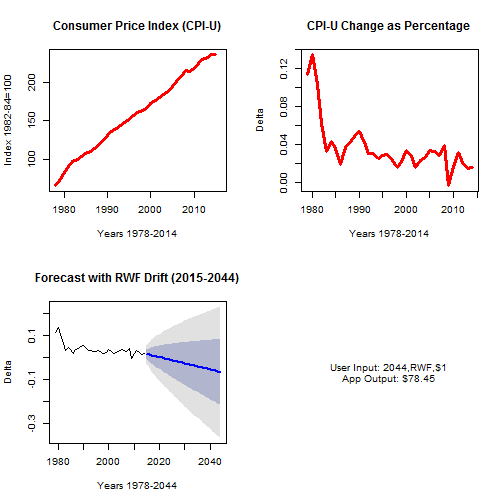

## Consumer Price Index (CPI)

- This application is based on the CPI computed from 1978 to 2014 by the United States Bureau of Labor Statistics (BLS). 
- There are different types of CPI algorithms that U.S. BLS has used over the years. This Shiny app is based on CPI-U for all urban consumers with a based/index period of 1982-1984=100.
- The annual change of CPI-U is calculated by this Shiny app as a percentage to determine yearly U.S. Dollar inflation rates. 
- Data Source: [Consumer Price Index (CPI-U)](http://www.bls.gov/cpi/)

---

## Application: Predict Inflation


- The Predict Inflation is a Shiny app that uses the `forecast` library to predict future inflation rates. 
- The app is inspired by the BLS [CPI Inflation Calculator](http://www.bls.gov/data/inflation_calculator.htm).
- The app can help people predict the future cost of an expense using current dollar (2014) values.
- At this time the app only uses the Upper inflation rate of the 99% confidence level.

---

## How the Application Works


```r
library(forecast)
cpiUts <- ts(cpiU$Annual, start=c(1978), end=c(2014), frequency=1) #Time series obj of CPI-U
cpiUper <- cpiUts/lag(cpiUts,-1) - 1                            #Annual inflation percentage
cpiUperd <- rwf(cpiUper, h=30, drift=TRUE, level=c(80,99), fan=FALSE, lambda=NULL)#30yr forecast
p<-1 #Pricipal amount $1 dollar (or user input)
for(i in 1:30) {p <- as.numeric(p*cpiUperd$upper[i,2])+p} #RWF Upper 99% compound interest 30yr
```

- The user inputs a dollar amount, future year, and selects forecast method.
- The app calculates compounding interest based on predicted year-by-year inflation.
- The app output is future inflated dollar amount of that expense.

Access:

- [Shiny app - https://rick2015.shinyapps.io/Developing_Data_Products/](https://rick2015.shinyapps.io/Developing_Data_Products/)
- [ui.R - https://github.com/Rick2015/Developing-Data-Products/blob/master/ui.R](https://github.com/Rick2015/Developing-Data-Products/blob/master/ui.R)
- [server.r - https://github.com/Rick2015/Developing-Data-Products/blob/master/server.r](https://github.com/Rick2015/Developing-Data-Products/blob/master/server.r)

---

## How the Data Looks


---
